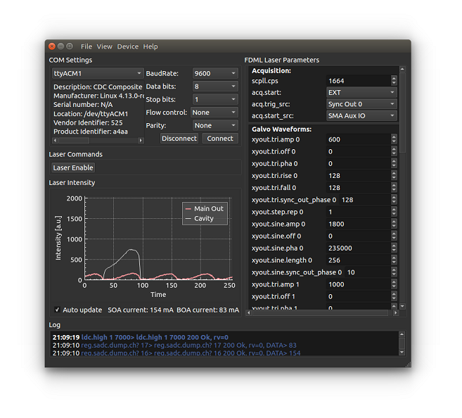

#  FDMLControl

FDMLControl enables the control of the [Optores](https://www.optores.com/) FDML laser via a serial connection.

  

Features
--------

* **Dynamic GUI generation**   
All the FDML laser parameters that can be seen in the graphical user interface are generated from a XML file during start up. The XML file ([fdml_commands.xml](src/fdml_commands.xml)) is placed in the same folder as the executable and can be modified to adjust FDMLControl to possible firmware updates of the Optores FDML laser.

* **Expert mode**  
The expert mode enables access to more advanced features such as a custom command console. 

* **Admin privileges**  
Admin privileges can be obtained by placing a file with the corresponding key in the same folder as the executable. This makes it possible to change laser parameters which otherwise could not be accessed. FDMLControl obtaines admin privileges automatically if "key.dat" is found in the same folder as the executable during start up. Please contact [Optores](https://www.optores.com/) if you need the admin key for your laser. 

* **Cross platform**  
FDMLControl runs on Windows and Linux. (Probably also on Mac, but this has not been tested yet.)

Download and Installation
----------

A precompiled package for Windows (64bit) can be downloaded from:
[GitHub release section](https://github.com/spectralcode/FDMLControl/releases/download/v1.0.0/FDMLControl_v1.0.0_win64.zip).

Extract the zip archive and execute FDMLControl, installation is not necessary.

If you need FDMLControl for a different operating system, the easiest way is to compile it yourself. See the compiling section.

Compiling
---------

Compiling FDMLControl requires installation of [Qt](https://www.qt.io/). Once you have installed Qt the easiest way to compile
FDMLControl is with the QtCreator. Clone/Download the FDMLControl source files and open the .pro file with QtCreator to compile FDMLControl for your operating system.  
The final step is to copy [fdml_commands.xml](src/fdml_commands.xml) to the application folder. If you have the administrator key for your laser, you can create a file containing only the key and name it "key.dat". Copy key.dat to the application folder as well.

Contributors
--------------------

Alexander Heisterkamp - Institute of Quantum Optics, Leibniz University Hannover 
Tammo Ripken -  Industrial and Biomedical Optics Department, Laser Zentrum Hannover e.V.

Acknowledgement
--------------------
Many thanks to Tim, who searched the Optores user manual for information on each parameter to complete the XML file. 

## License
FDMLControl is free software and licensed under GPLv3. See [LICENSE](LICENSE).
